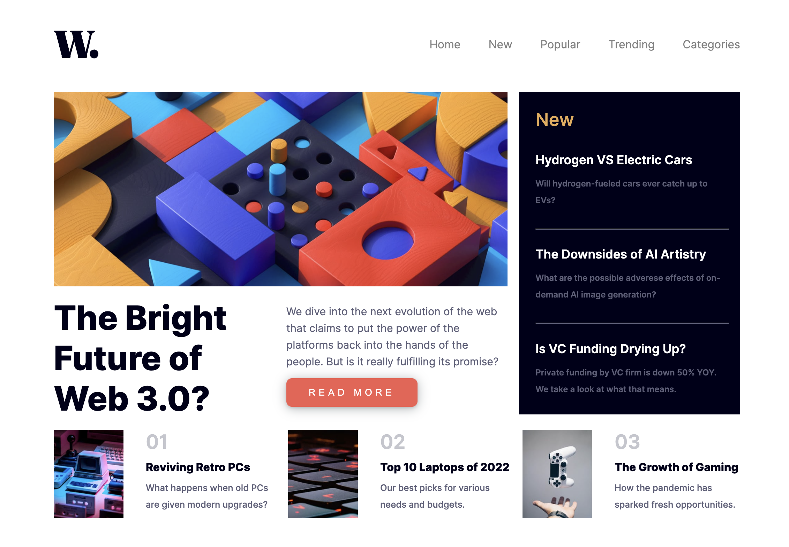
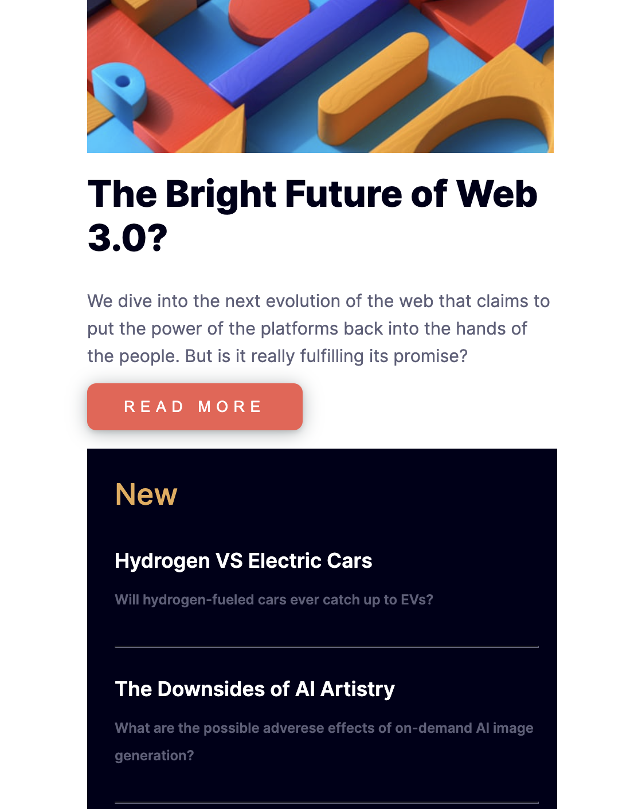
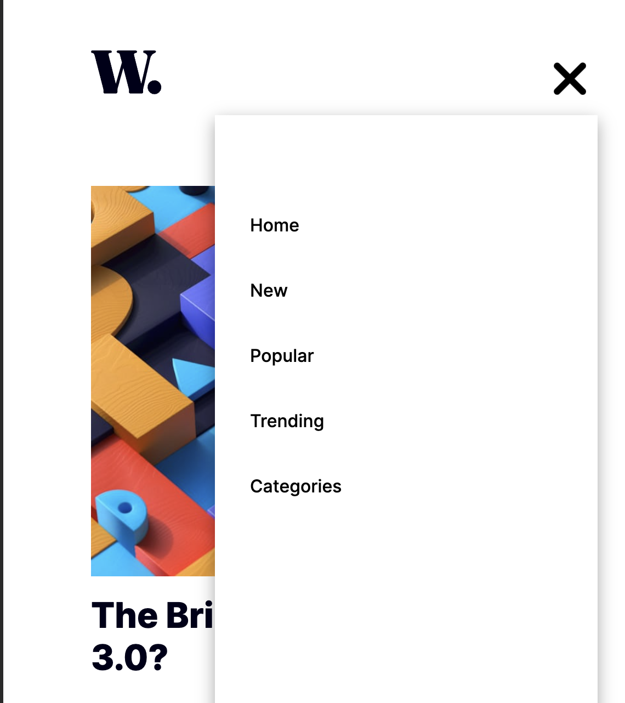

# News Homepage - CSS Project

This repository contains my solution for the News Homepage CSS project, where I created a responsive news homepage with a hamburger icon for mobile navigation. The project was inspired by a challenge on Frontend Mentor.

## Overview

### The Challenge

The goal of this project was to design and implement a news homepage with a responsive layout. A key feature was the inclusion of a hamburger icon for mobile users, allowing for smooth navigation on smaller screens.

### Screenshot

**_Desktop_**

**_Mobile_**

**_Sidebar_**

### Built with

- HTML5
- CSS3 (Media queries for responsiveness)
- Pure CSS for the hamburger icon

### What I Learned

Through this project, I gained a deeper understanding of creating responsive layouts using media queries. Implementing the hamburger icon using only CSS helped me grasp the concept of CSS-based mobile navigation without relying on JavaScript.

### Continued Development

In future iterations, I plan to explore additional CSS techniques for enhancing the overall design and user experience. This may include implementing transitions and animations to create a more visually appealing and interactive news homepage.

### Useful Resources

- [MDN Web Docs](https://developer.mozilla.org/en-US/docs/Web) - Valuable resource for HTML and CSS documentation.
- [CSS Tricks](https://css-tricks.com/) - Helpful tips and tricks for CSS development.

## Author

- Divnoor Singh Nagra
